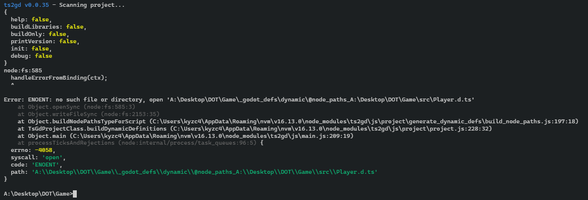

### The Error:



### As Text:

```
ts2gd v0.0.35 - Scanning project...
{
  help: false,
  buildLibraries: false,
  buildOnly: false,
  printVersion: false,
  init: false,
  debug: false
}
node:fs:585
  handleErrorFromBinding(ctx);
  ^

Error: ENOENT: no such file or directory, open 'A:\Desktop\DOT\Game\_godot_defs\dynamic\@node_paths_A:\Desktop\DOT\Game\src\Player.d.ts'
    at Object.openSync (node:fs:585:3)
    at Object.writeFileSync (node:fs:2153:35)
    at Object.buildNodePathsTypeForScript (C:\Users\kyzc4\AppData\Roaming\nvm\v16.13.0\node_modules\ts2gd\js\project\generate_dynamic_defs\build_node_paths.js:197:18)
    at TsGdProjectClass.buildDynamicDefinitions (C:\Users\kyzc4\AppData\Roaming\nvm\v16.13.0\node_modules\ts2gd\js\project\project.js:228:32)
    at Object.main (C:\Users\kyzc4\AppData\Roaming\nvm\v16.13.0\node_modules\ts2gd\js\main.js:209:19)
    at processTicksAndRejections (node:internal/process/task_queues:96:5) {
  errno: -4058,
  syscall: 'open',
  code: 'ENOENT',
  path: 'A:\\Desktop\\DOT\\Game\\_godot_defs\\dynamic\\@node_paths_A:\\Desktop\\DOT\\Game\\src\\Player.d.ts'
}
```
